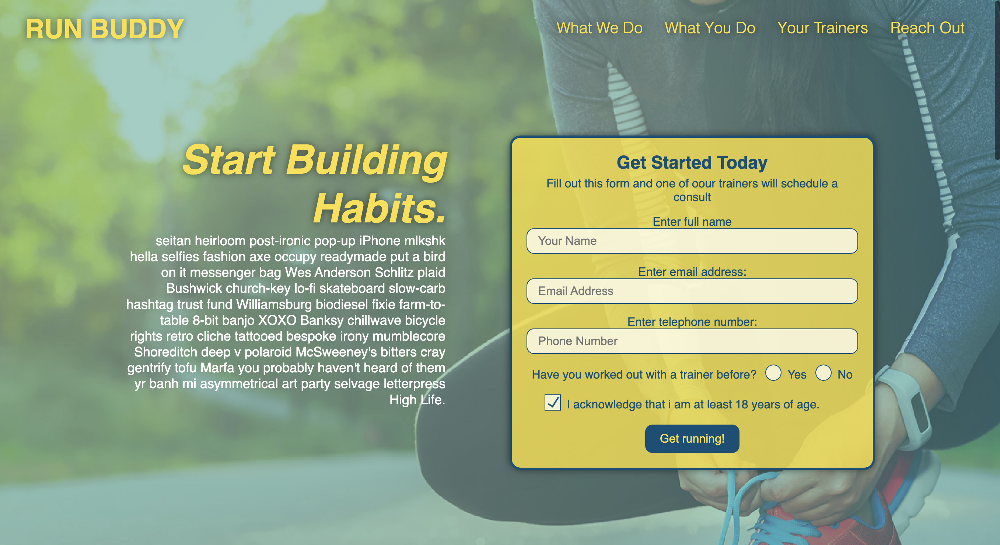

# Jose-Zuniga-Portfolio-Page

# build HTML structure 
start by building out the skeleton of a proper webpage with a head, body, and footer

# Build header/Navigation 

build out the header and navigation so I can include my full name + 3 navigation sections. About me, My Work, & Contact me. Each tab should be clickable and the pages' UI should send user to exact location on website. 

# build skeleton for about me section  

Need a detailed blurb about my qualifications + a picture that loads up as soon as page is loaded in browser 

# Build skeleton for "my work" section

need to show 5 apps that I have built. The first app needs to show the largest on the screen with the other 4 under that one. All app images need to be clickable and send the user to the desired app

** note since we have not built out the other 4 apps, I linked them all to Run Buddy just to show the capability. I can swap out the links in the future once we complete those apps

# Build skeleton for "contact me" section 

This needs to have all information about how to best reach me (phone, email, address) + a contact form for ease of reach out for new employers

# Add footer 

Just need to add who made the web page

# Add CSS and begin styling

create a CSS style sheet and begin giving page color. Taking contrast and user redability into context I choose 3 colors that will be the entire theme of the page. I added them to the root for easy call out as I build out CSS. I also added standard fonts for entire sheet, and text alignments.

# Link CSS sheet to HTML

# create flex boxes 

Add flex boxes for each class to ahve better control of positioning on webspage and greater usability across screens

# Added Media Queries 

To make sure that the webpage adjust to most devices I added 3 media quieres for screens that are 980px, 768px, and 575px. 

# Hade multiple commits along the way 

Properly documents the HTML and CSS sheet while also added multiple git commits as I pushed to the remote repository to keep proper documentation 

# Made page live using git pages 

Published the final desing using git pages. You can see it here: https://josezuniga01.github.io/Jose-Zuniga-Portfolio-Page/ 

You can also see image here: 
